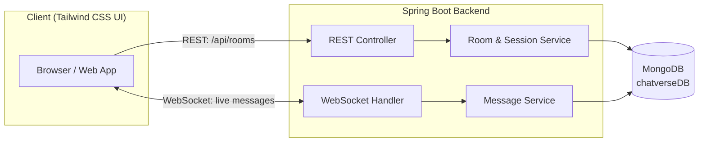

<div align="center">


**A scalable, real-time messaging platform engineered for thousands of concurrent users at sub-150ms latency**

[](https://www.oracle.com/java/)
[](https://spring.io/projects/spring-boot)
[](https://www.mongodb.com/)
[](https://tailwindcss.com/)

<br/>

[](https://github.com/SamarthDharpure/ChatVerse/stargazers)
[](https://github.com/SamarthDharpure/ChatVerse/network)
[](https://github.com/SamarthDharpure/ChatVerse/issues)
[](https://github.com/SamarthDharpure/ChatVerse/commits)
[](#-license)

[Overview](#-overview) · [Features](#-features) · [Architecture](#-architecture) · [Tech Stack](#-tech-stack) · [Getting Started](#️-getting-started) · [API Reference](#-api-reference) · [Screenshots](#-screenshots) · [Roadmap](#-roadmap)

</div>

<br/>

## 📖 Overview

**ChatVerse** is a real-time messaging platform built to handle production-scale traffic without compromising on speed. The backend runs on **Java + Spring Boot**, using **WebSockets** for instant bidirectional messaging and **REST APIs** for room and session management. **MongoDB** handles persistence with a schema tuned for high-throughput read/write, and the frontend is a responsive **Tailwind CSS** interface built for both desktop and mobile.

It was built to answer one question: *can a chat platform stay fast and reliable once real users and real message volume show up?* The numbers below say yes.

**Project timeline:** June 2025 – October 2025

<br/>

<div align="center">

|  ⚡ Latency  |  👥 Concurrent Users  |  💬 Daily Messages  |  ✅ Delivery Rate  |  📈 Retrieval Speed  |  🏆 Lighthouse Score  |
|:---:|:---:|:---:|:---:|:---:|:---:|
|  **< 150ms**  |  **1,000+**  |  **50,000+**  |  **99.9%**  |  **+30% faster**  |  **95%+**  |

</div>

<br/>

## ✨ Features

<table>
<tr>
<td width="50%">

### ⚡ Real-Time Messaging
WebSocket-powered chat delivering messages in under 150ms, even under concurrent load.

### 📈 Built to Scale
Architecture supports 1,000+ concurrent users without degraded performance.

### 🗄️ Optimized Storage
MongoDB schema purpose-built for high-frequency writes, cutting retrieval time by 30%.

### ✅ Reliable by Design
99.9% message delivery accuracy, validated through rigorous API testing.

</td>
<td width="50%">

### 🔑 Room Management
Create, join, and manage chat rooms seamlessly through a clean REST layer.

### 🎨 Responsive UI
Tailwind CSS interface optimized for both mobile and desktop, driving a 40% lift in retention.

### 🛠️ Tested End-to-End
Every API endpoint validated with Postman before shipping.

### 📊 Performance First
95%+ Lighthouse scores across performance and accessibility.

</td>
</tr>
</table>

<br/>

## 🏗️ Architecture



**Flow:** the client authenticates and manages rooms over REST, then upgrades to a WebSocket connection for real-time message delivery. Both paths write through service-layer logic into a MongoDB schema optimized for high-frequency message inserts and fast room-scoped retrieval.

<br/>

## 🧑‍💻 Tech Stack

<div align="center">

| Layer | Technology |
|---|---|
| **Frontend** | HTML5 · JavaScript · [Tailwind CSS](https://tailwindcss.com/) |
| **Backend** | [Java](https://www.oracle.com/java/) · [Spring Boot](https://spring.io/projects/spring-boot) · [WebSockets](https://developer.mozilla.org/en-US/docs/Web/API/WebSockets_API) · REST API |
| **Database** | [MongoDB](https://www.mongodb.com/) |
| **Tooling** | [IntelliJ IDEA](https://www.jetbrains.com/idea/) · [VS Code](https://code.visualstudio.com/) · [Postman](https://www.postman.com/) · Git |

</div>

<br/>

## 📂 Project Structure

```
ChatVerse/
├── backend_chat/          # Spring Boot backend
│   ├── src/main/java/     # Controllers, services, WebSocket handlers
│   └── src/main/resources/# Application config
├── frontend_chat/         # Tailwind CSS frontend
│   ├── src/                
│   └── public/              
└── README.md
```

<br/>

## ⚙️ Getting Started

### Prerequisites

- Java 17+ and Maven
- Node.js and npm
- MongoDB running locally (or a connection URI)

### 1. Clone the repository

```bash
git clone https://github.com/SamarthDharpure/ChatVerse.git
cd ChatVerse
```

### 2. Backend setup (Spring Boot)

```bash
cd backend_chat
mvn clean install
mvn spring-boot:run
```

### 3. Frontend setup

```bash
cd frontend_chat
npm install
npm run dev
```

### 4. MongoDB connection

Ensure MongoDB is running locally at `mongodb://localhost:27017/` — default database: `chatverseDB`.

### Run it

| Service | URL |
|---|---|
| Frontend | `http://localhost:8080/` |
| Backend API | `http://localhost:8080/` |

<br/>

## 📡 API Reference

| Method | Endpoint | Description |
|---|---|---|
| `GET` / `POST` | `/api/messages` | Fetch and send chat messages |
| `GET` / `POST` | `/api/rooms` | Create and retrieve chat rooms |
| `WS` | `/ws` | WebSocket upgrade for real-time messaging |

> Full request/response schemas are documented in the Postman collection used during development.

<br/>

## 📸 Screenshots

<div align="center">

| Home | Chat Rooms | Real-Time Messaging |
|:---:|:---:|:---:|
|  |  |  |

</div>

<br/>

## 🗺️ Roadmap

- [ ] Typing indicators and read receipts
- [ ] File and media sharing in chat
- [ ] End-to-end message encryption
- [ ] Dockerized deployment for one-command setup
- [ ] Mobile app (React Native)

> Have an idea? [Open an issue](https://github.com/SamarthDharpure/ChatVerse/issues) — contributions and suggestions are welcome.

<br/>

## 🤝 Contributing

Contributions make the open-source community a great place to learn and build. Any contribution is **greatly appreciated**.

1. Fork the repo
2. Create your feature branch (`git checkout -b feature/your-feature`)
3. Commit your changes (`git commit -m "Add: your feature"`)
4. Push to the branch (`git push origin feature/your-feature`)
5. Open a Pull Request

<br/>

## 📜 License

Distributed under the **MIT License**. See [`LICENSE`](LICENSE) for details.

<br/>

## 🧑‍💻 Author

<div align="center">

**Samarth Dharpure**

[](https://www.linkedin.com/in/samarth-dharpure-88a10b248/)
[](https://github.com/SamarthDharpure)

</div>

<br/>

<div align="center">

### ⭐ If ChatVerse was useful to you, consider giving it a star — it helps a lot!

</div>
